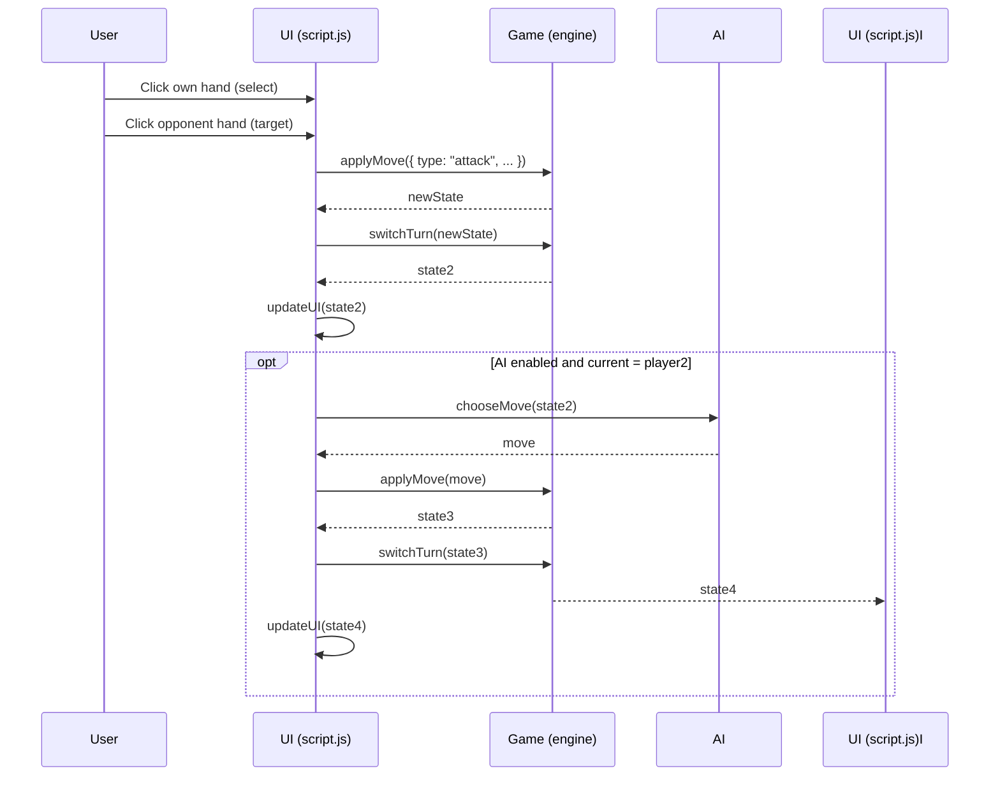
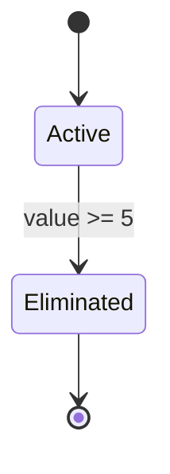
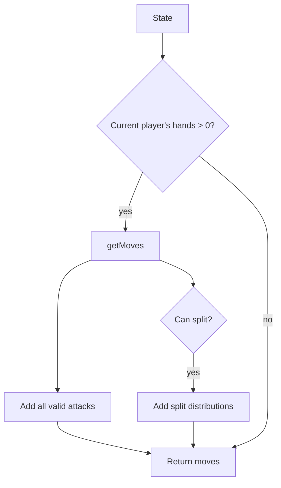

# Chopsticks – Technical Overview

This document describes the architecture, modules, and extension points of the Chopsticks project after the functional refactor.

## High-level Architecture

- src/engine/game.js

- Pure, functional game engine.

- No DOM or I/O.

- Exposes the Game API (state, move generation, application, win checks).

- src/ai/ai.js

- AI helpers and strategy stubs.

- Uses only the Game API.

- src/ui/script.js

- UI controller that wires DOM events to the Game API.

- Optionally calls into AI strategies if an AI mode is enabled.

- app.entry.js

- Bundler entry. Ensures engine, AI, and UI are loaded in order.

- dist/app.bundle.js

- Bundled/minified script for the browser (no raw sources exposed in production).

## Game API (src/engine/game.js)

- State / Turn

- Game.createInitialState()

- Game.cloneState(state)

- Game.getCurrentPlayer(state)

- Game.switchTurn(state)

- Status

- Game.hasLost(state, player)

- Game.isTerminal(state)

- Game.getWinner(state)

- Game.canSplitState(state, player)

- Moves

- Game.getMoves(state)

- Game.applyMove(state, move)

- Game.attack(state, fromHand, toPlayer, toHand)

- Game.split(state, left, right)

- Board View

- Game.getBoard(state) -> { current, p1: [l,r], p2: [l,r] }

Move shapes

- Attack: { type: 'attack', attackerPlayer, attackerHand: 'left'|'right', targetPlayer, targetHand }

- Split: { type: 'split', player, left, right }

## AI Module (src/ai/ai.js)

- AI.randomMove(state)

- AI.greedyMove(state)

- Stubs to implement:

- AI.heuristic(state)

- AI.minimaxMove(state, { depth, evaluate })

- AI.expectimaxMove(state, { depth, evaluate })

- AI.mctsMove(state, { iterations, timeMs })

- AI.customMove(state)

Example loop (headless):

```js

import  {  Game  }  from  './src/engine/game.js';

import  {  AI  }  from  './src/ai/ai.js';

  

let  s  =  Game.createInitialState();

while (!Game.isTerminal(s)) {

const  mv  =  AI.greedyMove(s) ||  AI.randomMove(s);

if (!mv) break;

s  =  Game.applyMove(s,  mv);

s  =  Game.switchTurn(s);

}

console.log('Winner:',  Game.getWinner(s));

```

## UI Controller (src/ui/script.js)

- Renders counts, selections, and turn indicator

- Handlers call Game.applyMove then Game.switchTurn

- Clap modal uses Game.canSplitState and split moves

- Optional AI turn via selected strategy function

## Diagrams (Mermaid)

Sequence – Human turn (attack), AI responds:



State – Hand lifecycle per player:



Flow – Move generation overview:



## Development

- npm run dev # serve + sourcemaps

- npm run dev:watch # watch rebuilds

- npm run build # minified bundle to dist/app.bundle.js

## Testing

- tests/chopsticks.test.js includes basic mechanics tests.

- Consider adding engine-only tests importing src/engine/game.js.

## Notes

- The browser build exposes Game and AI on window for convenience.

- For production, serve index.html with dist/app.bundle.js to avoid exposing raw sources.
